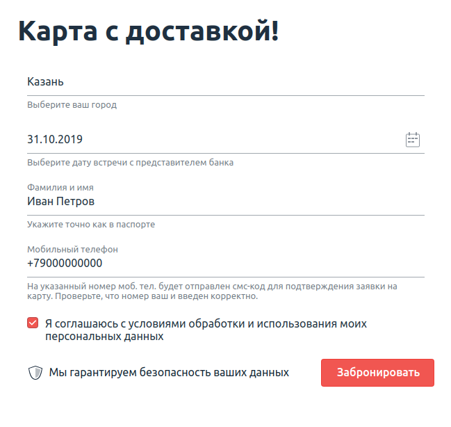
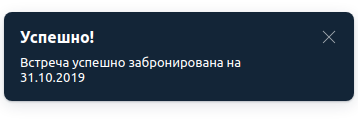

## Задача №1: заказ доставки карты ##
Вам необходимо автоматизировать тестирование формы заказа доставки карты:

Требования к содержимому полей:
1. Город — один из административных центров субъектов РФ.
2. Дата — не ранее трёх дней с текущей даты.
3. В поле фамилии и имени разрешены только русские буквы, дефисы и пробелы.
4. В поле телефона — только 11 цифр, символ + на первом месте.
5. Флажок согласия должен быть выставлен.
Тестируемая функциональность: отправка формы.

Поля «Город» и «Дата» заполняются через прямой ввод значений без использования выбора из выпадающего списка и всплывающего календаря.

Условия: если все поля заполнены корректно, то форма переходит в состояние загрузки:

Важно: состояние загрузки не должно длиться более 15 секунд.

После успешной отправки формы появится всплывающее окно об успешном завершении бронирования:

